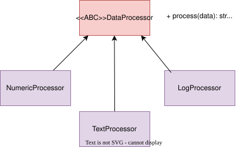
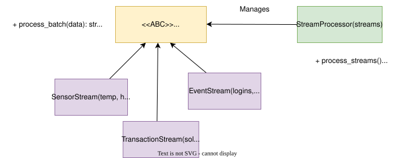
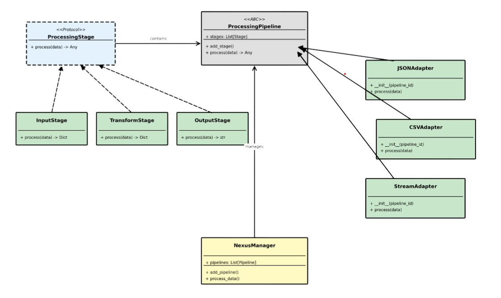

*This project was created as part of the 42 curriculum by aabi-mou.*

# Overview
This module focuses on two core object-oriented programming concepts:

- **Inheritance**: a subtype can reuse and extend behavior from a parent type.
- **Polymorphism**: different subtypes can be used through the same interface.

The project contains three exercises built around subtype polymorphism.

# Exercises
## ex0


## ex1


## ex2


# Installation and Testing
```bash
git clone git@vogsphere.42beirut.com:vogsphere/intra-uuid-37656026-c184-4b9c-9321-6107ecc2c527-7230421-aabi-mou py05
cd py05
```

Run the checker from the project root:
```bash
python main.py
```
This validates that required type annotations are present.

Each exercise also includes its own `main` block for local demonstration output similar to the subject examples.

# References
- Medium

# AI Usage
AI was used to clarify subject concepts and to help verify type-annotation coverage.
